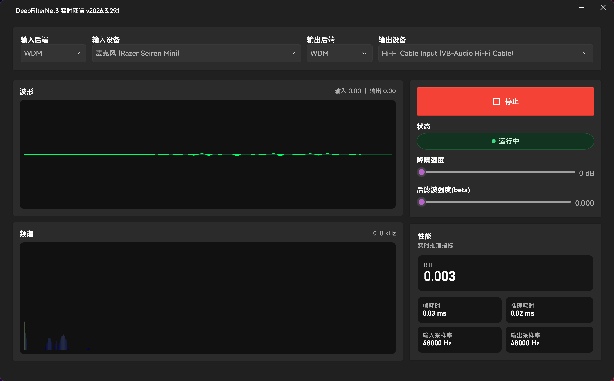

# DeepFilterNet3 GUI (WPF-UI)

基于 WPF-UI 的实时语音降噪桌面客户端，使用 DeepFilterNet3 官方 C-API（`df.dll`）进行推理。支持输入/输出设备与音频后端选择，并提供波形、频谱与性能指标展示。默认仅 CPU 推理。

**界面预览**


**声明**
该软件使用 AI 制作，本人未写一行代码，全靠插特鸡批踢勤勤恳恳，当牛做马，耗时半天，倾情巨献。该软件仅用于个人使用，后续更新全看心情，有问题别找我，能 PR 直接 PR。

**致谢**
- DeepFilterNet：`https://github.com/Rikorose/DeepFilterNet`

**亮点**
- 实时降噪：麦克风输入 -> `df.dll`（内部 STFT/推理/ISTFT）-> 扬声器输出。
- 后端与设备可选：WDM / MME / KS / ASIO（ASIO 输入输出需同一驱动）。
- 监控与可视化：波形、频谱、RTF、帧耗时等指标。
- 托盘常驻：支持最小化到托盘、关闭到托盘、启动到托盘。
- 开机启动：可在设置中启用（写入 `HKCU\Run`）。
- 日志可控：文件日志可通过配置开关启用。

**快速开始**
环境要求：

- Windows 10/11。
- .NET 10 SDK。
- 可用音频驱动（WDM/MME/KS/ASIO）。

构建与运行：

```bash
dotnet restore
dotnet build
dotnet run --project DeepFilterNetGui/DeepFilterNetGui.csproj
```

**依赖包**

| 包                 | 版本   |
| ------------------ | ------ |
| `WPF-UI`           | 4.2.0  |
| `WPF-UI.Tray`      | 4.2.0  |
| `NAudio`           | 2.2.1  |
| `PortAudioSharp2`  | 1.0.6  |

**模型准备**

- 模型包必须是 `.tar.gz`（例如 `DeepFilterNet3_onnx.tar.gz`），并放在程序输出目录下的 `Models` 文件夹中。
- 开发模式默认输出目录：`DeepFilterNetGui/bin/Debug/net10.0-windows/Models`。
- 程序启动会检查模型文件是否存在，界面不再提供模型选择。

**推理参数说明**

| 项目 | 说明 |
| --- | --- |
| 采样率 | 必须为 48000 Hz（输入/输出会自动重采样到 48k） |
| 帧长 | 由 `df.dll` 返回（当前为 480） |
| STFT/ERB/Lookahead | 全部由 `df.dll` 内部处理 |

**使用流程**

1. 选择输入/输出后端与设备。
2. 点击开始按钮启动实时推理。
3. 状态指示器显示运行状态，波形/频谱/性能在运行时更新。

**音频后端说明**

| 后端 | 说明 |
| ---- | ---- |
| WDM  | WASAPI 共享模式，兼容性较好。 |
| MME  | 传统接口，延迟较高。 |
| KS   | 通过 PortAudio WDM-KS，依赖驱动支持。 |
| ASIO | 输入/输出必须同一驱动，且输入/输出后端都需为 ASIO。 |

**配置文件**
配置文件路径：`deepfilternet3.settings.json`（与 exe 同目录）。

| 字段 | 说明 |
| --- | --- |
| `EnableFileLogging` | 是否输出日志文件 |
| `EnableAutoStart` | 是否启用开机启动 |
| `MinimizeToTray` | 最小化到托盘 |
| `CloseToTray` | 关闭到托盘 |
| `StartToTray` | 启动到托盘 |
| `LastInputBackend` | 上次输入后端 |
| `LastOutputBackend` | 上次输出后端 |
| `LastInputDeviceId` | 上次输入设备 |
| `LastOutputDeviceId` | 上次输出设备 |

**日志文件**
文件日志默认关闭，开启后输出到 `logs/deepfilternet3-*.log`。

**自动启动行为**

- 如果检测到上次启动的设备可用，将在启动后自动开始推理。
- 若设备缺失，会弹出提示并停止自动开始。

**托盘行为**

- 托盘图标常驻。
- 左键：恢复主界面。
- 右键菜单：打开主界面 / 设置 / 退出。

**常见问题**

1. 启动提示“模型不存在”
   把模型包放到 `Models` 文件夹后重新打开即可。
2. ASIO 启动失败
   ASIO 输入输出必须选择同一驱动，并且输入/输出后端都为 ASIO。
3. KS 启动失败
   驱动可能不支持当前格式或独占模式，建议切换 WDM/MME 进行验证。
4. 没有声音或输出很小
   确认输入采样率为 48k，并检查输出设备音量与通道数设置。

**已知限制**

- 仅支持 CPU 推理。
- 仅支持单声道流式降噪。
- 模型采样率固定为 48k。
- 运行中不支持热切换模型。

**许可**
本项目采用双许可证（MIT 或 Apache-2.0），详见根目录 `LICENSE` / `LICENSE-MIT` / `LICENSE-APACHE`。


